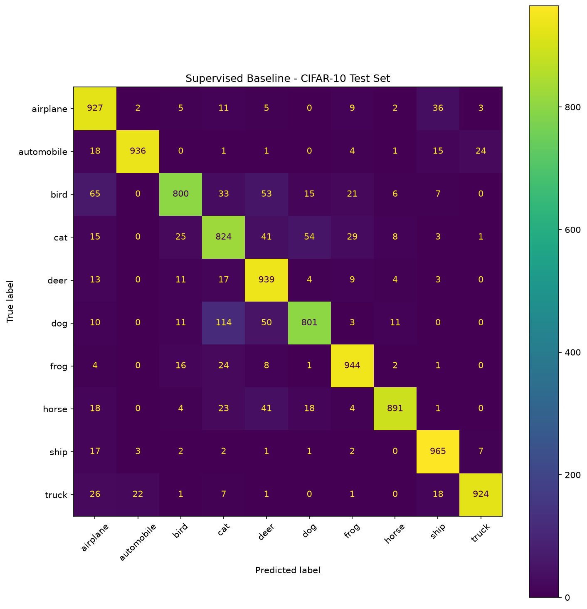
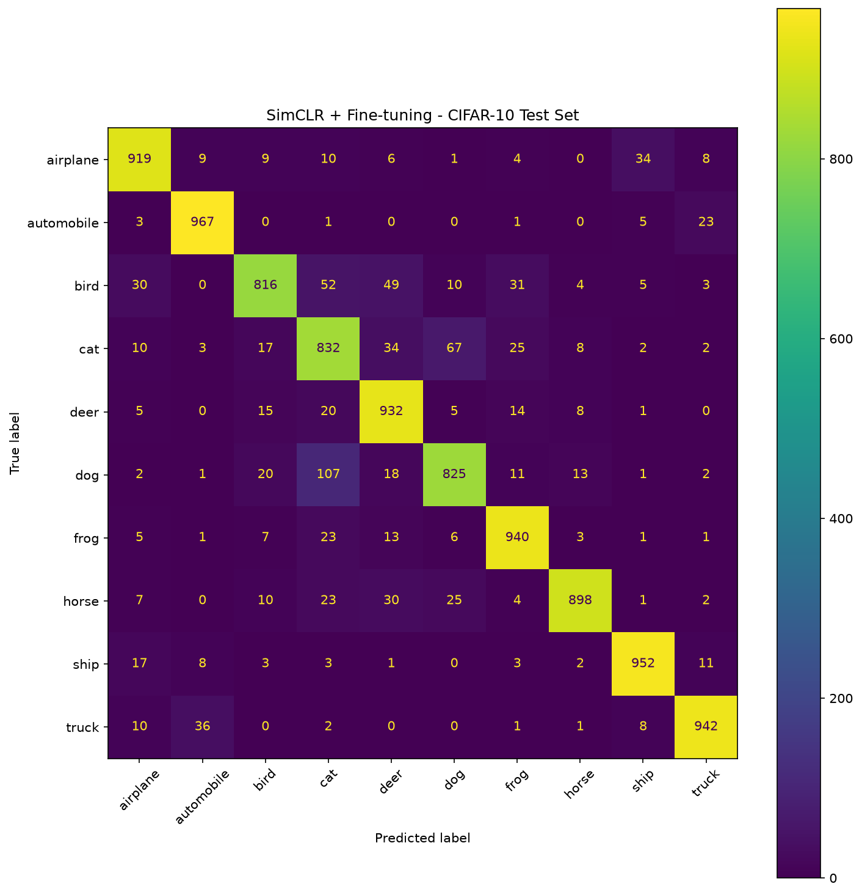

# Self-Supervised Learning Basics — Project 01

## SimCLR on CIFAR-10

A practical implementation of **Self-Supervised Learning (SSL)** and **Contrastive Learning** using **SimCLR** on the CIFAR-10 dataset.

The main goal of this project is educational: to understand how contrastive self-supervised learning works in practice, how representations learned without labels can be evaluated, and how they can be transferred to a downstream classification task.

The project follows a complete pipeline from self-supervised pretraining to final test evaluation and comparison with a supervised baseline.

---

## 🎯 Objectives

This project was designed to gain hands-on experience with:

* Self-Supervised Learning
* Contrastive Learning
* SimCLR
* Data Augmentation for Contrastive Learning
* NT-Xent Contrastive Loss
* Representation Learning
* Linear Evaluation
* Fine-tuning
* Supervised Baseline Comparison
* Final Test Set Evaluation

The goal is **not** to achieve state-of-the-art performance, but to build a clear and reproducible understanding of the SimCLR workflow.

---

## 🔬 Project Pipeline

```text
CIFAR-10
    ↓
SimCLR Data Augmentation
    ↓
Two Augmented Views
    ↓
ResNet18 Encoder
    ↓
Projection Head
    ↓
NT-Xent Contrastive Loss
    ↓
Self-Supervised Pretraining
    ↓
Learned Representation
    ↓
Linear Evaluation
    ↓
Fine-tuning
    ↓
Final Test Evaluation
    ↓
Comparison with Supervised Baseline
```

---

## 📊 Dataset

The project uses the **CIFAR-10** dataset.

CIFAR-10 contains:

* 60,000 color images
* 10 classes
* Image size: 32 × 32 pixels
* 50,000 training images
* 10,000 test images

The ten classes are:

```text
airplane
automobile
bird
cat
deer
dog
frog
horse
ship
truck
```

The official CIFAR-10 test set is used only for the final evaluation.

---

## 🧠 Model Architecture

### Encoder

The main encoder is a **ResNet18** adapted for CIFAR-10.

The architecture uses:

* 3 × 3 first convolution
* Stride 1
* No initial max pooling
* 512-dimensional feature representation

For SimCLR pretraining, the encoder is followed by a projection head.

```text
Input Image
    ↓
ResNet18 Encoder
    ↓
Feature Representation
    ↓
Projection Head
    ↓
Projection Space
```

After self-supervised pretraining, the projection head is discarded and the learned encoder representation is used for downstream classification.

---

## 🔄 SimCLR Pretraining

During SimCLR training, each original image is transformed twice using independently sampled augmentations.

```text
Original Image
      │
      ├───────────────┐
      ↓               ↓
Augmentation 1   Augmentation 2
      ↓               ↓
    View 1           View 2
      │               │
      └───────┬───────┘
              ↓
       Shared Encoder
              ↓
       Projection Head
              ↓
       Contrastive Loss
```

The two augmented views of the same image form a **positive pair**.

Views generated from different images act as **negative pairs**.

The objective is to learn representations where positive pairs are close in representation space while negative pairs are pushed apart.

---

## 📐 NT-Xent Contrastive Loss

The project uses the **NT-Xent (Normalized Temperature-scaled Cross Entropy) loss**, which is the contrastive objective used in SimCLR.

At a high level, the loss encourages:

* Similar representations for two augmented views of the same image.
* Different representations for views originating from different images.

This allows the encoder to learn useful visual representations without using class labels during pretraining.

---

## ⚙️ Training Configuration

| Parameter         | Value      |
| ----------------- | ---------- |
| Dataset           | CIFAR-10   |
| Encoder           | ResNet18   |
| SimCLR Batch Size | 128        |
| SimCLR Epochs     | 50         |
| Framework         | PyTorch    |
| Hardware          | CUDA / GPU |

---

# 🧪 Experiments

## 1. SimCLR Self-Supervised Pretraining

The encoder was pretrained using the SimCLR contrastive learning objective for 50 epochs.

Final training loss:

```text
Epoch 50
Average Loss: 4.7574
```

The contrastive training loss decreased throughout pretraining:

| Epoch | Average Loss |
| ----- | -----------: |
| 1     |       5.1322 |
| 10    |       4.8351 |
| 20    |       4.7987 |
| 30    |       4.7783 |
| 40    |       4.7667 |
| 50    |       4.7574 |

The pretrained encoder checkpoint was saved during the experiment.

---

## 2. Linear Evaluation

In the linear evaluation experiment:

* The SimCLR-pretrained encoder was frozen.
* A linear classifier was trained on top of the learned representations.
* The encoder parameters were not updated.

Best validation accuracy:

```text
78.70%
```

This experiment demonstrates that the self-supervised encoder learned representations that contain useful information for downstream CIFAR-10 classification, even when the encoder itself is kept frozen.

---

## 3. Fine-tuning

In the fine-tuning experiment:

* The pretrained SimCLR encoder was loaded.
* A classification head was added.
* The entire network was fine-tuned using labeled CIFAR-10 training data.

Unlike linear evaluation, the encoder was allowed to update its parameters.

Best validation accuracy:

```text
91.16%
```

Final test accuracy:

```text
90.23%
```

---

## 4. Supervised Baseline

A ResNet18 model with random initialization was trained directly using CIFAR-10 class labels.

The baseline provides a reference point for evaluating whether SimCLR pretraining provides a useful initialization.

Final test accuracy:

```text
89.51%
```

---

# 📈 Final Results

The final comparison was performed on the official CIFAR-10 test set containing 10,000 images.

| Experiment                 | Best Validation Accuracy | Test Accuracy |
| -------------------------- | -----------------------: | ------------: |
| Supervised Baseline        |                        — |    **89.51%** |
| SimCLR + Linear Evaluation |               **78.70%** |             — |
| SimCLR + Fine-tuning       |               **91.16%** |    **90.23%** |

### Final Comparison

| Model                |               Test Accuracy |
| -------------------- | --------------------------: |
| Supervised Baseline  |                  **89.51%** |
| SimCLR + Fine-tuning |                  **90.23%** |
| Improvement          | **+0.72 percentage points** |

The SimCLR-pretrained model achieved a **0.72 percentage-point improvement** over the supervised baseline on the held-out CIFAR-10 test set.

The test set was not used for model selection. Checkpoints were selected based on validation performance and evaluated on the test set only for final comparison.

---

# 🧩 Confusion Matrices

The following confusion matrices were generated using the same CIFAR-10 test set used for final evaluation.

### Supervised Baseline



### SimCLR + Fine-tuning



The confusion matrices show that both models perform well on visually distinct classes, while some errors remain between visually similar categories such as:

* cat and dog
* deer and horse
* bird and other animal classes

The SimCLR + fine-tuning model improves the overall test accuracy, although improvements are not uniform across every individual class.

---

# 🔍 Key Findings

### 1. Self-supervised pretraining learned useful representations

The linear evaluation experiment achieved:

```text
78.70% Best Validation Accuracy
```

while keeping the pretrained encoder frozen.

This indicates that SimCLR learned representations containing useful semantic information without using class labels during pretraining.

### 2. Fine-tuning significantly improved downstream performance

Allowing the pretrained encoder to adapt to the supervised classification task increased validation performance to:

```text
91.16%
```

and resulted in:

```text
90.23% Test Accuracy
```

### 3. SimCLR provided a better initialization than the supervised baseline

The final test comparison was:

```text
Supervised Baseline:      89.51%
SimCLR + Fine-tuning:     90.23%

Improvement:              +0.72 percentage points
```

This experiment suggests that the representation learned through contrastive self-supervised pretraining can provide a useful initialization for downstream classification.

### 4. Validation and test performance are different

The best fine-tuning validation accuracy was 91.16%, while the final test accuracy was 90.23%.

This is expected because the validation set was used during model selection, while the test set was reserved for final evaluation.

---

# 📁 Project Structure

```text
01_simclr_cifar10/
│
├── configs/
│
├── data/
│   └── CIFAR-10 dataset
│
├── experiments/
│
├── notebooks/
│   └── 01_visualize_simclr_augmentations.ipynb
│
├── results/
│   ├── confusion_matrix_baseline.png
│   ├── confusion_matrix_finetune.png
│   └── simclr/
│       └── train_log.json
│
├── src/
│   ├── data/
│   │   ├── augmentations.py
│   │   ├── dataloader.py
│   │   ├── dataset.py
│   │   ├── simclr_dataloader.py
│   │   ├── simclr_dataset.py
│   │   ├── supervised_dataset.py
│   │   └── transforms.py
│   │
│   ├── losses/
│   │   └── nt_xent.py
│   │
│   ├── models/
│   │   ├── linear_classifier.py
│   │   ├── resnet_classifier.py
│   │   └── simclr_model.py
│   │
│   ├── confusion_matrix.py
│   ├── evaluate.py
│   ├── run_baseline.py
│   ├── train_baseline.py
│   ├── train_finetune.py
│   ├── train_linear.py
│   └── train_simclr.py
│
├── .gitignore
├── requirements.txt
└── README.md
```

---

# 🚀 How to Run

## 1. Clone the repository

```bash
git clone <repository-url>
cd self-supervised-learning-basics/01_simclr_cifar10
```

## 2. Create a virtual environment

```bash
python -m venv .venv
source .venv/bin/activate
```

## 3. Install dependencies

```bash
pip install -r requirements.txt
```

## 4. Run SimCLR pretraining

```bash
python -m src.train_simclr
```

## 5. Run Linear Evaluation

```bash
python -m src.train_linear
```

## 6. Run Fine-tuning

```bash
python -m src.train_finetune
```

## 7. Train the Supervised Baseline

```bash
python -m src.run_baseline
```

## 8. Run Final Test Evaluation

```bash
python -m src.evaluate
```

## 9. Generate Confusion Matrices

```bash
python -m src.confusion_matrix
```

---

# 🛠️ Technologies

* Python
* PyTorch
* Torchvision
* NumPy
* Scikit-learn
* Matplotlib
* Jupyter Notebook
* CUDA

---

# 📚 What I Learned

This project provided practical experience with the complete workflow of contrastive self-supervised learning:

```text
Self-Supervised Pretraining
        ↓
Representation Learning
        ↓
Linear Evaluation
        ↓
Fine-tuning
        ↓
Downstream Classification
        ↓
Final Test Evaluation
```

The main takeaway is that self-supervised learning can learn useful visual representations without requiring labels during pretraining. These representations can then be transferred to a supervised downstream task and further improved through fine-tuning.

---

# 🔮 Future Work

Possible extensions include:

* Comparing SimCLR with other contrastive methods such as MoCo or BYOL.
* Exploring different batch sizes and temperature values.
* Evaluating the learned representations with fewer labeled samples.
* Comparing different encoder architectures.
* Applying self-supervised learning to medical imaging datasets.

---

## 📌 Project Status

**Completed — Mini Project 1**

This project is part of a broader learning path toward Self-Supervised Learning and Multimodal Representation Learning for medical AI.